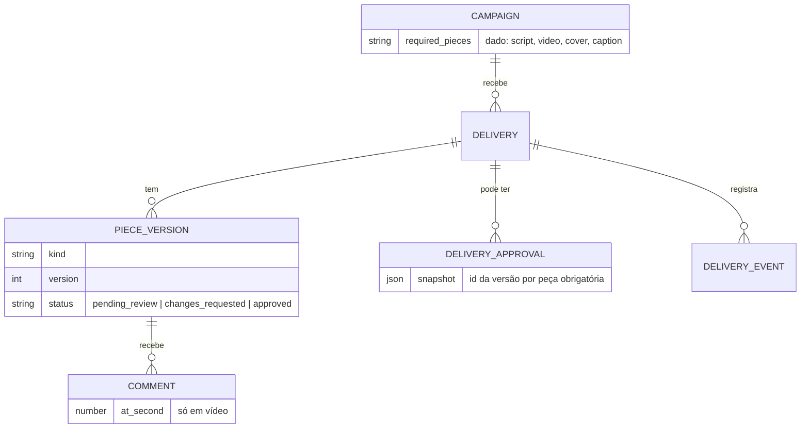
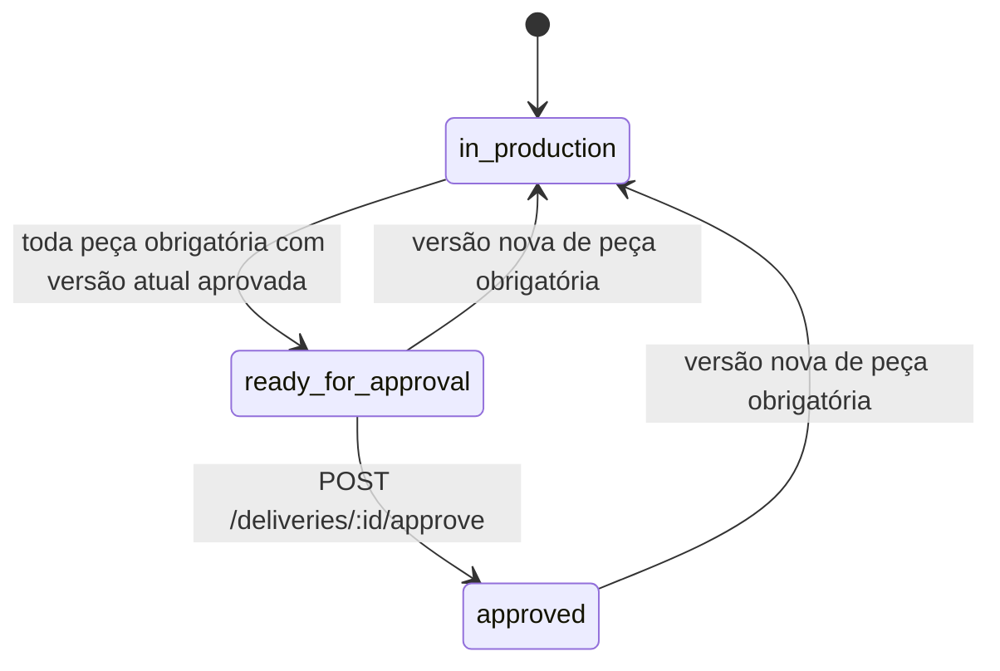

# Revisão de vídeo

API de revisão de entregas de campanha: versões de peças (roteiro, vídeo, capa, legenda), comentários presos a um segundo do vídeo e a regra que decide quando a entrega pode ser aprovada.

A regra central: **a entrega só aprova quando cada peça que a campanha exige tem a versão atual aprovada**. Peça nova numa entrega já aprovada desfaz a aprovação.

## Como rodar

Node 22+.

```
npm install
npm run dev        # http://localhost:3000 (PORT=3917 para outra porta)
npm test
npm run typecheck
```

O armazenamento é em memória: reiniciar o servidor zera tudo. O upload é fake: a versão guarda uma URL (ou texto, para roteiro e legenda). O que não é fake é a regra.

Autenticação é um substituto por header, em toda rota que escreve:

```
x-actor-role: brand | creator
x-actor-id:   <id>
```

A marca que cria a campanha é a dona dela. O criador que abre a entrega é o dono dela.

## Rotas

| Rota | Quem | O que faz |
| --- | --- | --- |
| `POST /campaigns` | marca | cria campanha `{name, required_pieces}` |
| `GET /campaigns/:id` | | lê a campanha |
| `POST /deliveries` | criador | abre entrega `{campaign_id}` (uma por criador por campanha) |
| `GET /deliveries/:id` | | status, peças, `can_approve`, `blockers`, aprovação, pagamento, histórico |
| `POST /deliveries/:id/pieces/:kind/versions` | criador da entrega | envia uma versão nova da peça |
| `POST /deliveries/:id/approve` | marca da campanha | aprova a entrega |
| `GET /versions/:id` | | versão, comentários dela, `is_current` |
| `POST /versions/:id/approve` | marca da campanha | aprova a versão |
| `POST /versions/:id/request-changes` | marca da campanha | pede alterações `{note?}` |
| `POST /versions/:id/comments` | marca ou criador da entrega | comenta `{at_second?, body}` |

Corpo de cada peça: `script` e `caption` recebem `{text}`; `cover` recebe `{url}`; `video` recebe `{url, duration_seconds}`.

## Modelo



Versões, comentários, aprovações e eventos só são acrescentados. Só o status da versão muda, uma vez, na revisão. A versão atual de uma peça é a de maior número.

## Regra de aprovação

O status da entrega **não é guardado**. É calculado a cada leitura (`src/domain/delivery-status.ts`) a partir de três coisas: a lista `required_pieces` da campanha, a versão atual de cada peça e o último registro de aprovação.



- `in_production`: alguma peça obrigatória sem versão, aguardando revisão ou com alterações pedidas.
- `ready_for_approval`: nenhuma pendência, mas não há aprovação válida. A marca ainda precisa aprovar.
- `approved`: existe aprovação e, para toda peça obrigatória, a versão atual é exatamente a que foi aprovada.

A lista de peças obrigatórias é dado da campanha. Não existe `if` por tipo de peça: campanha só de vídeo e campanha com as quatro peças passam pelo mesmo código. A lista não muda depois de criada a campanha.

Peça fora da lista pode ser enviada e revisada, aparece com `"requirement": "not_required"` e nunca bloqueia.

Aprovar com pendência devolve 422, uma linha por peça:

```json
{"error":{"code":"required_pieces_pending","message":"A entrega não pode ser aprovada: há peças obrigatórias pendentes.","missing":[{"piece":"video","code":"pending_review","reason":"versão 1 aguardando revisão"},{"piece":"cover","code":"missing","reason":"sem versão enviada"}]}}
```

Os códigos são `missing`, `pending_review` e `changes_requested`. A mesma lista aparece em `blockers` no `GET /deliveries/:id`, com `can_approve`.

## Versão nova invalida a aprovação

A aprovação guarda um snapshot: o id da versão aprovada de cada peça obrigatória. Se chega versão nova de uma dessas peças, a versão atual deixa de ser a do snapshot e a entrega deixa de estar `approved`, mesmo que a versão nova já esteja aprovada. A marca precisa aprovar a entrega de novo, e a nova aprovação guarda outro snapshot.

Efeito no pagamento (modelo mínimo, sem pagamento real):

- Aprovar a entrega registra `payment_released`.
- Versão nova de peça obrigatória numa entrega aprovada registra `approval_invalidated` e `payment_hold`. O status do pagamento vira `on_hold`.
- Enquanto a nova versão não for aprovada e a entrega reaprovada, nada é liberado.
- Reaprovar registra `payment_released` outra vez, com a mesma `payout_key` (`delivery:<id>`). Quem paga de fato deve usar essa chave para não pagar duas vezes.
- Versão nova de peça que a campanha não exige não mexe na aprovação.

O histórico nunca é apagado: `GET /deliveries/:id` devolve todos os eventos em ordem.

## Comentários por segundo

Em versão de vídeo, `at_second` é obrigatório, numérico (decimal vale) e vai de 0 até a duração informada, inclusive. Fora disso, 422. Nas outras peças o comentário não tem segundo, e enviar `at_second` é erro (inclusive `null`).

O comentário pertence à versão onde foi feito. A versão nova começa sem comentários; `previous_versions_comments_count` só diz quantos existem nas anteriores. Versão antiga fica só para leitura: comentar ou revisar nela devolve 409 `version_not_current`.

Os comentários vêm ordenados por segundo.

## Exemplos reais

Saídas capturadas rodando o servidor (`PORT=3917`). `$B` = `-H x-actor-role:brand -H x-actor-id:marca_1`, `$C` = o mesmo com `creator` e `criador_1`, `$J` = `-H content-type:application/json`. Algumas respostas foram cortadas com `jq`.

```
$ curl -X POST localhost:3917/campaigns $B $J -d '{"name":"Lancamento Verao","required_pieces":["video","cover"]}'
{"id":"cmp_1","brand_id":"marca_1","name":"Lancamento Verao","required_pieces":["video","cover"],"created_at":"2026-10-09T15:26:02.147Z"}

$ curl -X POST localhost:3917/deliveries $C $J -d '{"campaign_id":"cmp_1"}'          # só status e blockers
{"id":"dlv_1","status":"in_production","can_approve":false,"blockers":[{"piece":"video","code":"missing","reason":"sem versão enviada"},{"piece":"cover","code":"missing","reason":"sem versão enviada"}]}

$ curl -X POST localhost:3917/deliveries/dlv_1/pieces/video/versions $C $J -d '{"url":"https://cdn.example.com/video-v1.mp4","duration_seconds":30}'
{"id":"ver_1","piece":"video","version":1,"status":"pending_review"}

$ curl -X POST localhost:3917/deliveries/dlv_1/approve $B                            # HTTP 422
{"error":{"code":"required_pieces_pending","message":"A entrega não pode ser aprovada: há peças obrigatórias pendentes.","missing":[{"piece":"video","code":"pending_review","reason":"versão 1 aguardando revisão"},{"piece":"cover","code":"missing","reason":"sem versão enviada"}]}}

$ curl -X POST localhost:3917/versions/ver_1/comments $B $J -d '{"at_second":12.5,"body":"Logo some aqui"}'
{"id":"cmt_1","version_id":"ver_1","at_second":12.5,"body":"Logo some aqui","author":"marca_1","created_at":"2026-10-09T15:26:10.495Z"}

$ curl -X POST localhost:3917/versions/ver_1/comments $B $J -d '{"at_second":45,"body":"Fora do video"}'   # HTTP 422
{"error":{"code":"validation_failed","message":"Dados inválidos.","fields":[{"field":"at_second","message":"obrigatório, entre 0 e 30 (duração do vídeo)"}]}}

$ curl -X POST localhost:3917/versions/ver_1/request-changes $B $J -d '{"note":"Ajustar o logo"}'
{"id":"ver_1","version":1,"status":"changes_requested","review_note":"Ajustar o logo"}

$ curl -X POST localhost:3917/deliveries/dlv_1/pieces/video/versions $C $J -d '{"url":"https://cdn.example.com/video-v2.mp4","duration_seconds":28}'
{"id":"ver_2","piece":"video","version":2,"status":"pending_review"}

$ curl localhost:3917/versions/ver_2                                                 # comentário não migrou
{"id":"ver_2","version":2,"is_current":true,"comments":[],"previous_versions_comments_count":1}

$ curl localhost:3917/versions/ver_1                                                 # continua na versão 1
{"id":"ver_1","version":1,"is_current":false,"comments":[{"at_second":12.5,"body":"Logo some aqui"}]}

$ curl -X POST localhost:3917/versions/ver_1/approve $B                              # HTTP 409
{"error":{"code":"version_not_current","message":"A versão 1 de video foi substituída pela versão 2. Só a versão atual aceita revisão e comentários.","current_version_id":"ver_2","current_version":2}}
```

Depois de aprovar `ver_2`, enviar e aprovar a capa (`ver_3`) e aprovar a entrega:

```
$ curl -X POST localhost:3917/deliveries/dlv_1/approve $B
{"status":"approved","can_approve":false,"payment":{"status":"released","payout_key":"delivery:dlv_1"},"approval":{"id":"apr_1","snapshot":{"video":"ver_2","cover":"ver_3"},"valid":true}}

$ curl -X POST localhost:3917/deliveries/dlv_1/pieces/cover/versions $C $J -d '{"url":"https://cdn.example.com/capa-v2.png"}'
{"id":"ver_4","piece":"cover","version":2,"status":"pending_review"}

$ curl localhost:3917/deliveries/dlv_1
{"status":"in_production","can_approve":false,"blockers":[{"piece":"cover","code":"pending_review","reason":"versão 2 aguardando revisão"}],"payment":{"status":"on_hold","payout_key":"delivery:dlv_1"},"approval":{"id":"apr_1","snapshot":{"video":"ver_2","cover":"ver_3"},"valid":false}}
```

Fim do histórico nesse ponto (`history[].type`): `... delivery_approved, payment_released, version_submitted, approval_invalidated, payment_hold`. Aprovando `ver_4` e a entrega de novo:

```
$ curl -X POST localhost:3917/deliveries/dlv_1/approve $B
{"status":"approved","payment":{"status":"released","payout_key":"delivery:dlv_1"},"approval":{"id":"apr_2","snapshot":{"video":"ver_2","cover":"ver_4"},"valid":true}}
```

## O que ficou de fora

- Persistência. O `Store` é uma interface (`src/storage/store.ts`) com implementação em memória; escolhi memória para não depender de módulo experimental do Node nem de arquivo de banco, e trocar por SQL não toca domínio nem HTTP. A interface é síncrona, o que encaixa em `node:sqlite`; para um driver assíncrono ela teria de mudar.
- Autenticação real, leitura protegida (os `GET` são abertos) e paginação.
- Upload de arquivo; a URL não é verificada nem baixada, e a duração do vídeo é informada pelo criador.
- Pagamento de verdade e estado de repasse concluído. Se o repasse já tiver saído antes da invalidação, hoje o sistema só registra `payment_hold`; estorno não está modelado.
- Mudar `required_pieces` depois de criada a campanha.
- Desfazer revisão: a versão revisada não volta para `pending_review`. Para mudar de ideia, o criador envia versão nova.
- Concorrência entre processos. Em um processo só, cada operação roda inteira sem intercalar; com banco real seria preciso transação.

## Testes

```
npm test
```

Vitest, 41 testes, sem rede: o app roda em memória com relógio injetado.

- `required-pieces`: 422 com peça faltando e peça aguardando revisão, peça não exigida que não bloqueia, campanha só de vídeo sem roteiro, duas campanhas com exigências diferentes no mesmo código.
- `versions`: versão nova substitui a atual e a antiga continua legível, 409 ao revisar versão antiga, validação do conteúdo por peça.
- `approval-invalidation`: entrega aprovada recebe versão nova numa peça, deixa de estar aprovada, pagamento em espera, reaprovação funciona; peça não exigida não invalida.
- `comments`: comentário preso a um segundo, visível na versão onde foi feito e ausente na seguinte; segundo além da duração rejeitado; limites 0 e duração.
- `access` e `delivery-status`: permissões por papel e dono, e a função pura de status.

## Uso de IA

O código e os testes foram escritos com um assistente de IA (Claude), que eu dirigi. Eu defini o escopo e as decisões de modelo e revisei o resultado.

O que eu revisei e ajustei:

- Pedi que o status da entrega fosse calculado, não um booleano guardado, e conferi a função de status. Para ter certeza de que o teste pega o erro, tirei a comparação com o snapshot da aprovação e confirmei que os testes de reaprovação falham.
- Decidi o que o pagamento faz na invalidação (`payment_hold`, reaprovação com a mesma `payout_key`) e escrevi isso na seção acima, junto com o que não está coberto.
- Decidi que só a versão atual aceita revisão e comentário, e que `at_second` em peça que não é vídeo é erro em vez de ser ignorado.
- Troquei o tratamento do corpo opcional de `request-changes`, que veio como um atalho torto, por um leitor de JSON com modo opcional; e usei nomes sem acento nos exemplos de curl, porque o curl no Windows enviava o corpo em outra codificação.
